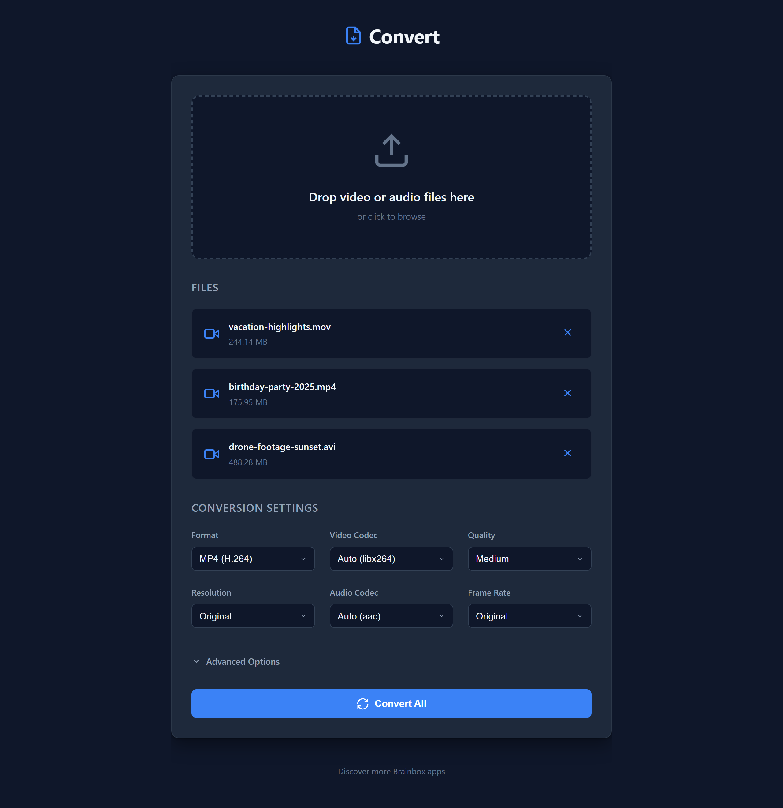
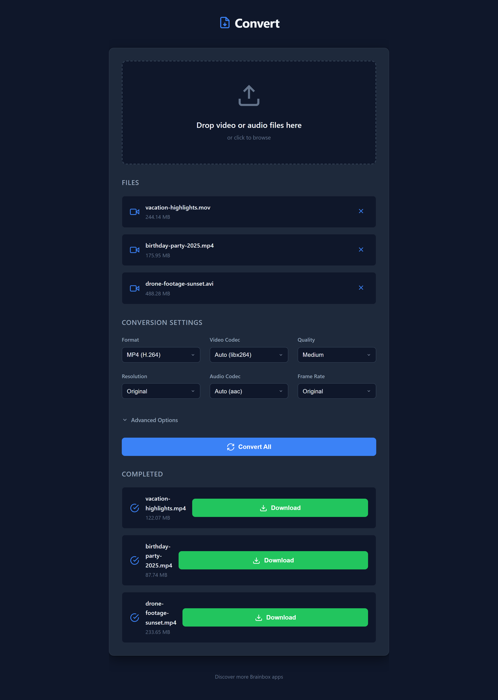

# Convert - Video Converter PWA

A beautiful, simple Progressive Web App for converting videos to different formats using FFmpeg.wasm. Works entirely in your browser - no server uploads needed!

## Features

- 🎬 Convert videos to MP4, WebM, AVI, MOV formats
- 🎨 Beautiful, intuitive interface
- 📱 Installable as a PWA on any device
- 🔒 Privacy-focused - all processing happens in your browser
- ⚡ Fast conversion using FFmpeg.wasm
- 🎯 Drag & drop support for multiple files
- ⚙️ Customizable quality and resolution settings

## Screenshots

## Usage

1. Visit the app (will be deployed to GitHub Pages)
2. Drag and drop video files or click to browse
3. Adjust conversion settings (format, codec, quality, resolution)
4. Click "Convert All" and wait for processing
5. Download your converted videos

## Installation

The app can be installed on your device:

- **Desktop**: Click the install icon in your browser's address bar
- **Mobile**: Use "Add to Home Screen" from your browser menu

## Development

This is a static PWA built with:
- Pure HTML, CSS, and JavaScript (no frameworks)
- FFmpeg.wasm for video processing
- Service Worker for offline functionality
- Progressive Web App features

To run locally:
1. Clone this repository
2. Serve the files with any static file server
3. Open in a modern browser

## Deployment

The app automatically deploys to GitHub Pages on push to the main branch using GitHub Actions.

## License

See LICENSE file for details.
